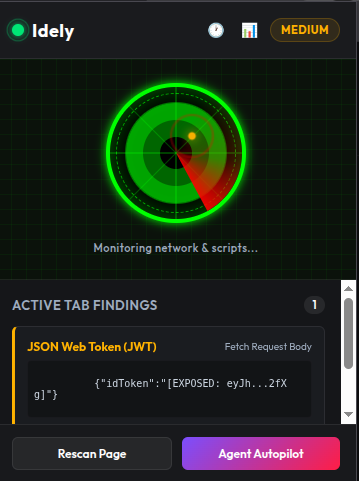

# Idely — Security Agent & Dashboard Extension

Idely is a powerful, local-first browser extension designed to act as an "Agent Autopilot" that monitors, detects, and records exposed credentials, API keys, and sensitive tokens across the web pages you visit. 

With a focus on proactive security and zero-trust execution, Idely automatically scans the DOM, inline scripts, external javascript files, and browser storage for leaked secrets before they can be exploited.

## 🚀 Key Features

- **Agent Autopilot Scanning**: Automatically audits all loaded scripts (both inline and external), DOM elements, and storage for over 50+ known credential patterns (AWS, Firebase, Stripe, JWTs, etc.).
- **Granular Detail Capture**: Captures the exact line number, column, variable name, surrounding code context, and even infers the usage (e.g., "Used as HTTP Authorization header") for every leaked secret.
- **Unified Security Dashboard**: A beautiful, rich interface that merges your Audit Trail, Credential Findings, GitHub Scanner, and Extension Settings into one seamless experience.
- **Website-Wise Filtering**: Easily filter your exposed credentials by the specific domain/website they were found on, making it trivial to track down leaks per project.
- **Encrypted Local Storage**: Long-term history of sensitive credentials is encrypted locally using AES-GCM before being stored in your browser, ensuring your history remains secure.
- **GitHub Repository Scanner**: Audit any public or authorized private GitHub repository's commit history directly from the extension to catch historical secret leaks.
- **Data Export & Whitelisting**: Export your findings as JSON or CSV, and whitelist internal domains or ignore specific mock-secrets to reduce noise.

## 📸 Screenshots

## 🛠️ Architecture

- `manifest.json`: Manifest V3 compliant extension architecture.
- `scanner.js`: The core regex and entropy-based scanning engine.
- `content.js` & `inject.js`: Injected scripts that monitor network requests and scrape page content for the scanner.
- `background.js`: Service worker handling encrypted storage, cross-origin fetch requests, and state persistence.
- `crypto.js`: Local AES-GCM encryption handler.
- `dashboard.html` & `dashboard.js`: The unified, high-performance UI for interacting with your scan history.

## 📦 Installation

1. Clone or download this repository.
2. Open your Chromium-based browser (Chrome, Edge, Brave) and navigate to `chrome://extensions/`.
3. Enable **Developer mode** in the top right corner.
4. Click **Load unpacked** and select the directory containing this repository.
5. The Idely icon will appear in your extensions bar. Click it to launch the popup and access the dashboard!

## 🛡️ Privacy First

Idely is designed with a local-first philosophy. All scanning happens locally within your browser. Discovered credentials are encrypted and stored locally via `chrome.storage.local`. Idely does not phone home or send your discovered secrets to any external servers.

## 📜 License

MIT License. See the LICENSE file for details.
